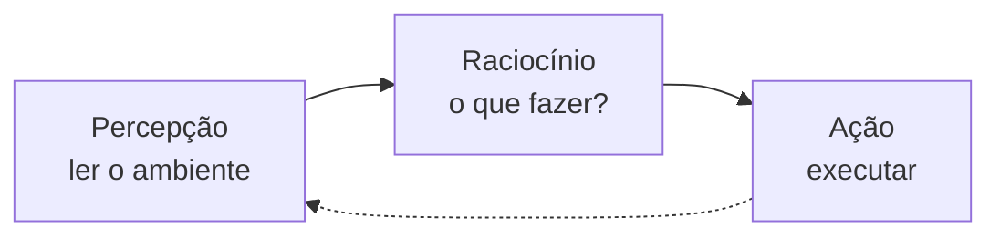

# O que são agentes de IA

## Definição

Um **agente de IA** é um sistema inteligente capaz de realizar ações de forma autônoma a partir da análise do seu ambiente, ou seja, do **contexto** em que está inserido. Em vez de apenas responder a uma pergunta, o agente percebe uma situação, decide o que fazer e executa essa ação sozinho.

> 💡 **Importante:** agente de IA **não é sinônimo** de IA generativa. São coisas diferentes, mas que se conectam: é muito comum usarmos um modelo de linguagem (LLM) como o "cérebro" que dá ao agente a capacidade de raciocinar e decidir o que fazer.

Pense assim: a IA generativa sabe **gerar texto**. O agente usa essa capacidade de gerar texto (ou raciocínio) para **decidir e executar ações** no mundo real ou dentro de um sistema.

Uma forma simples de resumir o que compõe um agente é essa fórmula:

> **Agente = Prompt + Contexto + Ferramentas (Tools) + Loop**

- **Prompt:** as instruções que orientam o comportamento do agente
- **Contexto:** as informações disponíveis sobre a situação atual
- **Ferramentas:** as ações que o agente pode de fato executar (buscar, consultar, escrever, chamar uma API)
- **Loop:** o ciclo que se repete até o objetivo ser alcançado

## Como um agente funciona

O funcionamento básico de um agente segue um ciclo de três etapas, que se repete continuamente:

1. **Percepção:** o agente recebe uma entrada, um pedido do usuário, um evento, uma mudança de estado.
2. **Raciocínio:** ele analisa essa entrada junto com o contexto disponível e decide qual ação (ou sequência de ações) faz sentido tomar.
3. **Ação:** ele executa essa decisão, seja chamando uma ferramenta, uma API, um banco de dados ou respondendo ao usuário.

### Exemplo do dia a dia

Um bom exemplo para visualizar isso é um comando de voz para uma assistente virtual:

> **"Alexa, bom dia"** → Alexa consulta o clima, liga as luzes, abre a persiana → **"Bom dia, Fulana! A temperatura hoje é X..."**

Repare que a Alexa não só respondeu uma frase pronta. Ela **interpretou** o pedido ("bom dia" como um gatilho para uma rotina), **decidiu** quais ações fazer (consultar clima, ligar luzes, abrir persiana) e **executou** cada uma delas antes de devolver uma resposta final. Esse é o comportamento típico de um agente.

## Tipos de agentes

Muito antes dos LLMs, a área de IA já estudava agentes e os separava por um critério simples: o quanto cada um planeja, lembra e aprende. Conhecer essa classificação ajuda a entender o que um agente moderno está (ou não está) fazendo por baixo. Na prática esses tipos não são gavetas fechadas, um agente real quase sempre mistura características de mais de um.

### Agente reativo

Age por estímulo e resposta: recebe uma entrada, devolve uma ação, e acabou. Não guarda memória do que aconteceu antes nem fica observando o ambiente por conta própria, só reage quando é acionado. Por não carregar histórico, costuma ser o mais rápido de rodar.

Pense num NPC de videogame que leva um tiro, entra em alerta por alguns segundos e depois volta ao estado inicial como se nada tivesse acontecido. Ele não "lembra" da luta anterior porque não foi feito para lembrar.

### Agente deliberativo

Antes de sair agindo, monta um plano ou um modelo do ambiente e decide a sequência de passos. Gasta um tempo "pensando" para errar menos na hora de executar.

O robô aspirador é um bom exemplo: ele tem uma planta da casa, sabe em que ponto dela está e traça uma rota para limpar tudo sem ficar batendo nas paredes à toa (às vezes ainda bate, mas a intenção está lá).

### Agente híbrido

Combina os dois anteriores: parte das decisões é reação imediata, parte passa por um planejamento mais cuidadoso. É o formato mais comum nos agentes de IA de hoje, que respondem rápido a pedidos simples e param para raciocinar nos casos mais complicados.

### Agente com aprendizado

Ajusta o próprio comportamento a partir da experiência: usa o resultado das ações passadas para decidir melhor no futuro, em vez de aplicar sempre a mesma lógica. É o tipo mais ambicioso e o mais difícil de fazer funcionar bem. A maioria dos agentes de IA atuais não aprende nesse sentido durante o uso, eles parecem espertos porque o LLM por trás já foi treinado com muita informação, não porque estão aprendendo com você em tempo real.

| Tipo            | Planeja antes de agir? | Tem memória? | Aprende com o uso?  |
| --------------- | ---------------------- | ------------ | ------------------- |
| Reativo         | não                    | não          | não                 |
| Deliberativo    | sim                    | às vezes     | não                 |
| Híbrido         | depende da tarefa      | sim          | não necessariamente |
| Com aprendizado | sim                    | sim          | sim                 |

### "Reativo" não é a mesma coisa que "ReAct"

Dois nomes parecidos que aparecem o tempo todo nesse assunto e é fácil confundir. **Agente reativo** é uma característica de arquitetura: o agente não tem memória e só responde a estímulos. **ReAct** (de _Reasoning + Acting_) é um paradigma de raciocínio intercalado com ação, detalhado em [Paradigma ReAct](/labs/ai/agents/02-react/).

Um agente que segue o ciclo ReAct mantém o histórico de pensamentos e observações enquanto resolve a tarefa, ou seja, tem memória de curto prazo. Por isso ele não é "reativo" no sentido clássico, mesmo com o nome tão parecido.

## Por que esse assunto está em alta

Agentes de IA não são uma ideia nova, o conceito existe há décadas dentro da área de Inteligência Artificial. O que mudou recentemente foi o avanço das **IAs generativas** (como os LLMs), que passaram a servir como um raciocinador muito mais flexível e barato de se colocar no centro de um agente.

Antes, para um sistema "decidir" o que fazer, era preciso programar regras fixas para cada situação possível. Com um LLM, o agente consegue interpretar linguagem natural, lidar com situações imprevistas e decidir dinamicamente qual ferramenta usar, isso tornou a construção de agentes muito mais acessível e é o motivo de tanto assunto quente sobre o tema atualmente.

## Onde agentes aparecem no dia a dia

Agentes de IA já estão presentes em diversas áreas. Alguns exemplos de uso comuns:

### Atendimento

- Consultar dados do cliente em sistemas internos
- Redirecionar dúvidas para o time ou fluxo correto
- Realizar ações pontuais, como emitir um boleto ou atualizar um cadastro

### Copilotos

- Criar e editar código
- Escrever documentação
- Fazer commits e abrir pull requests automaticamente
- Executar testes e corrigir bugs de forma autônoma

Exemplos conhecidos nessa categoria são o **Devin AI** e o **Cursor**, ferramentas que atuam como assistentes de desenvolvimento capazes de executar tarefas dentro do fluxo de trabalho de um programador.

### Auto-atendimento

- Compras online
- Movimentações financeiras
- Navegação em sistemas usando linguagem natural, sem precisar clicar em menus ou preencher formulários manualmente

## O que NÃO é um agente de IA

Nem todo sistema "inteligente" ou automatizado é um agente de IA. Vale a pena diferenciar:

- **Um chatbot simples**, que apenas responde perguntas com texto e não executa nenhuma ação no mundo (não consulta sistemas, não aciona ferramentas), não é um agente. Ele participa só da etapa de "raciocínio/resposta", sem a etapa de ação.
- **Automação tradicional (RPA)**, que segue um roteiro fixo de passos pré-programados sem interpretar contexto ou tomar decisões novas, também não é um agente de IA. Ela executa sempre a mesma sequência, sem raciocinar sobre o que fazer diante de uma situação diferente.
- **Um modelo de IA generativa sozinho**, como um LLM apenas gerando texto em resposta a um prompt, também não é um agente por si só. Ele só se torna parte de um agente quando ganha a capacidade de perceber o ambiente e agir sobre ele, por exemplo, chamando ferramentas ou tomando decisões autônomas.
- **Uma aplicação com IA embutida**, como um autocomplete, um sistema de recomendação ou uma análise automática de dados, também não é necessariamente um agente. Esses recursos usam IA para melhorar uma funcionalidade pontual, mas não decidem nem executam ações autônomas de ponta a ponta como um agente faz.

Em resumo: o que define um agente não é "usar IA", e sim a combinação de **perceber, raciocinar e agir de forma autônoma** sobre um ambiente.

## Referências

- **[O que são AGENTES DE I.A e como implementar](https://youtu.be/-Y9pynQDDC4)** - Augusto Galego, março de 2025. Vídeo prático que percorre a mesma trilha desta seção: a definição de agente como "LLM + autonomia", o ciclo percepção-raciocínio-ação e demonstrações ao vivo de como fazer uma LLM decidir e executar ações (function calling, saída estruturada e o framework LangChain), além dos tipos tradicionais de agente cobertos na seção "Tipos de agentes" acima.
