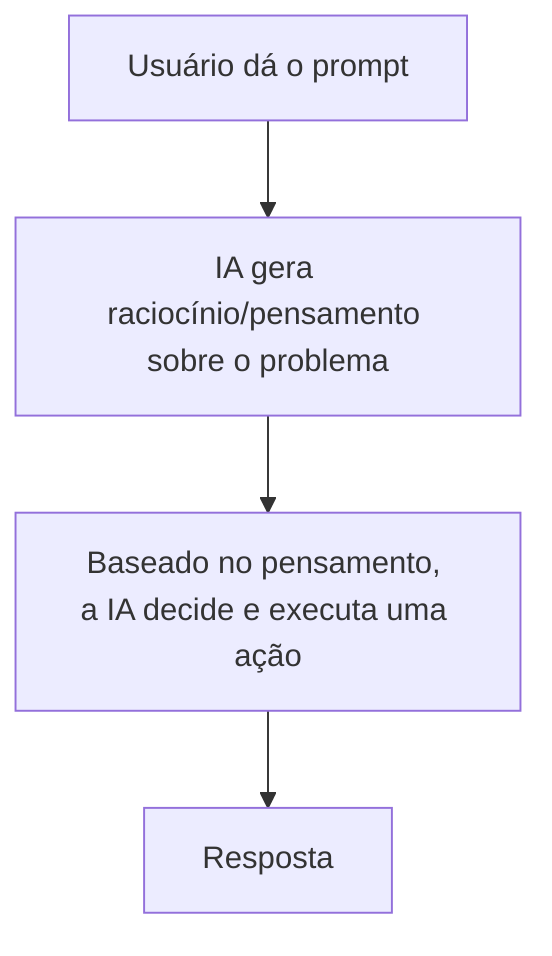

# Paradigma ReAct

## O que é o ReAct

**ReAct** é a junção de duas palavras: **Reasoning** (raciocínio) e **Acting** (ação). É um paradigma, uma forma de estruturar como um modelo de linguagem pensa e age, que propõe algo simples: em vez de o modelo ir direto para uma resposta final, ele intercala **raciocínio** (pensar em texto sobre o problema) com **ação** (executar algo com base nesse raciocínio).

O nome vem de um artigo de pesquisa de 2022 ("ReAct: Synergizing Reasoning and Acting in Language Models"), mas a ideia se tornou a base de praticamente todo agente de IA construído com LLMs hoje.

De forma resumida, o fluxo é:



A habilidade da IA de **raciocinar** sobre o problema antes de agir é o que permite que ela entenda a situação e escolha, de forma mais acurada, qual é a melhor ação a ser tomada. Sem esse raciocínio explícito, o modelo tende a "chutar" uma resposta direto, sem avaliar se realmente tem informação suficiente para isso.

## Como funciona na prática

Um exemplo comum ajuda a visualizar o ciclo. Imagine um agente que responde perguntas sobre o clima:

> **Usuário pergunta:** "Como está o tempo hoje?"

O agente não responde de imediato, ele segue um raciocínio em etapas:

```
Pensamento: Para responder, preciso saber a localidade do usuário.
Ação: descobrir a localidade do usuário.
Observação: usuário está em São Paulo.

Pensamento: Agora preciso saber a data de hoje.
Ação: descobrir o dia atual.
Observação: hoje é 21/08/2026.

Pensamento: Com localidade e data, posso buscar a previsão.
Ação: consultar site de previsão do tempo para São Paulo, 21/08/2026.
Observação: 24°C, parcialmente nublado.

Pensamento: já tenho o que preciso para responder.
Resposta final: Hoje em São Paulo está parcialmente nublado, com máxima de 24°C.
```

Cada pensamento decide a próxima ação, e cada observação (resultado da ação) alimenta o próximo pensamento, até o agente ter informação suficiente para dar a resposta final. Esse é o mesmo ciclo de percepção, raciocínio e ação que caracteriza qualquer agente de IA.

## Como esse paradigma influenciou os chats de IA atuais

O ReAct não ficou restrito a pesquisas acadêmicas, ele é a base do que hoje chamamos de **tool calling** (ou function calling) em produtos como ChatGPT e Gemini.

Quando você pede para o ChatGPT "pesquisar na web" ou "rodar um código", por baixo dos panos o modelo está seguindo esse mesmo ciclo: ele raciocina sobre o que precisa fazer, decide chamar uma ferramenta (busca na web, interpretador de código, geração de imagem), recebe o resultado dessa ferramenta como uma observação e continua raciocinando com base nesse novo dado, podendo chamar outra ferramenta ou já responder.

Antes do ReAct se popularizar, os LLMs eram usados praticamente só como "geradores de texto de uma vez só": você mandava um prompt e recebia uma resposta pronta, sem nenhuma verificação intermediária. Isso limitava muito o que esses modelos conseguiam fazer com confiabilidade, principalmente em tarefas que dependiam de informação atualizada ou de múltiplas etapas.

Com o raciocínio intercalado com ação, os modelos passaram a conseguir:

- Buscar informações atualizadas em vez de depender só do que aprenderam no treinamento
- Corrigir o próprio curso quando uma ação retorna um resultado inesperado
- Quebrar tarefas complexas em passos menores e mais confiáveis
- Mostrar o "porquê" de uma decisão, o que ajuda a debugar quando algo dá errado

Esse é o motivo pelo qual chats modernos como ChatGPT e Gemini conseguem, por exemplo, pesquisar na internet, consultar arquivos que você anexou ou rodar código antes de te dar uma resposta: eles não estão só "completando texto", estão seguindo um ciclo ReAct por trás da conversa.

## O que faz um agente ser bom

Nem todo agente que segue o ciclo ReAct funciona bem na prática. Alguns pontos separam um agente confiável de um que trava, erra ou desperdiça recursos:

- **Raciocínio claro e verificável:** um bom agente explicita o que está pensando em cada passo. Isso facilita tanto a depuração quanto a confiança no resultado.
- **Escolher a ação certa:** o agente precisa saber quando de fato precisa agir (buscar uma informação, chamar uma ferramenta) e quando já tem dados suficientes para responder direto, evitar ações desnecessárias economiza tempo e custo.
- **Saber quando parar:** um agente sem um critério de parada bem definido pode entrar em loop, repetindo ações sem chegar a uma resposta final. Um bom agente reconhece quando atingiu o objetivo.
- **Lidar bem com erros e observações inesperadas:** ações podem falhar, retornar dados vazios ou incompletos (por exemplo, o site de previsão do tempo pode estar fora do ar). Um agente robusto ajusta o raciocínio diante disso, em vez de travar ou inventar uma resposta.
- **Gerenciar o contexto:** conforme o ciclo de pensamento e ação se repete, o histórico cresce. Um bom agente mantém apenas o que é relevante para não perder o foco nem estourar o limite de contexto do modelo.
- **Objetivo bem definido:** agentes funcionam melhor quando têm um escopo claro do que devem (e não devem) fazer, isso reduz ambiguidade na hora de decidir a próxima ação.

Esses princípios valem tanto para um agente simples de poucas ferramentas quanto para sistemas mais complexos, como veremos nas próximas notas.
