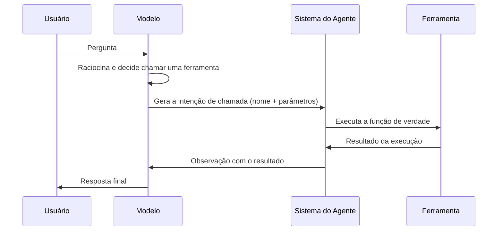

# Uso de Ferramentas

## Por que ferramentas importam

Um LLM sozinho só sabe gerar texto: ele não consulta um banco de dados, não manda um e-mail, não sabe nem que horas são agora. **Ferramentas** (ou _tools_) são o que conecta esse texto gerado a ações reais, seja consultar uma API, rodar uma consulta SQL, ler um arquivo ou chamar outro sistema.

Sem ferramentas, um agente é só um chatbot bem-falante. Com ferramentas, ele vira capaz de realizar tarefas de verdade, e é justamente essa capacidade que separa IA generativa de agente de IA, como vimos em [O que são agentes de IA](/labs/ai/agents/01-o-que-e/).

## O que é uma ferramenta

Uma ferramenta é uma função de código de verdade: um trecho de programa que faz algo concreto, como tocar uma música, consultar o clima ou salvar um registro em um banco de dados. O modelo em si não tem essa função dentro dele, quem a escreve e disponibiliza é o sistema que constrói o agente.

Para o modelo conseguir usar essas funções, o sistema precisa apresentar a ele um **catálogo**: a lista de ferramentas disponíveis, com o nome de cada uma e uma descrição do que ela faz. É só olhando esse catálogo que o modelo consegue decidir se alguma ferramenta ajuda a resolver o pedido do usuário, e qual delas escolher.

Imagine um usuário pedindo "toca uma música pra mim" para um agente que tem este catálogo disponível:

| Ferramenta             | O que faz                                         |
| ---------------------- | ------------------------------------------------- |
| `tocar_musica(nome)`   | Toca uma música específica em um player conectado |
| `buscar_letra(musica)` | Busca a letra de uma música                       |
| `criar_playlist(nome)` | Cria uma playlist vazia com o nome informado      |

O modelo lê o pedido, percorre o catálogo e percebe que `tocar_musica` é a função que resolve o problema, então decide chamá-la. Se nenhuma ferramenta do catálogo servisse para o pedido (por exemplo, se o usuário pedisse para "desligar a geladeira" e não existisse nenhuma função relacionada), o comportamento esperado do agente é reconhecer isso e avisar o usuário, não inventar uma execução que não existe.

## Como uma ferramenta é descrita para o modelo

O modelo não enxerga o código da ferramenta, ele recebe uma descrição estruturada dizendo o que ela faz, quais parâmetros aceita e o que cada parâmetro significa. Isso costuma ser feito com um schema em JSON:

```json
{
  "name": "consultar_clima",
  "description": "Consulta a previsão do tempo para uma cidade em uma data específica",
  "parameters": {
    "type": "object",
    "properties": {
      "cidade": { "type": "string", "description": "Nome da cidade" },
      "data": { "type": "string", "description": "Data no formato AAAA-MM-DD" }
    },
    "required": ["cidade", "data"]
  }
}
```

Quanto mais clara a descrição, melhor o modelo escolhe (e usa corretamente) a ferramenta certa na hora certa. Isso importa ainda mais quando o catálogo tem ferramentas parecidas: se `tocar_musica` e `buscar_letra` tivessem descrições vagas como "lida com música", o modelo teria dificuldade em discriminar qual delas de fato toca o áudio. Uma descrição objetiva, dizendo exatamente o efeito da função, é o que permite ao modelo separar uma ferramenta da outra.

## Quem executa a ferramenta de verdade

Um ponto que costuma confundir: o modelo **não tem capacidade de executar código**. Ele é, no fundo, um gerador de texto, o que ele faz ao "chamar uma ferramenta" é gerar um texto estruturado (geralmente JSON) dizendo qual função quer usar e com quais parâmetros. Quem lê esse texto, valida e roda a função de verdade é o sistema do agente, o código que está por fora do modelo orquestrando toda a conversa.



Essa separação é importante: o modelo só decide _o quê_ chamar, o sistema do agente é quem de fato _executa_ a chamada, valida os dados e devolve o resultado. Esse ciclo segue o mesmo padrão do [ReAct](/labs/ai/agents/02-react/), o modelo raciocina, decide chamar uma ferramenta, o sistema executa essa chamada fora do modelo e devolve o resultado como uma observação para o próximo passo de raciocínio.

## O que faz funcionar

Alguns pontos separam uma implementação que funciona bem na prática de uma que trava ou erra:

- Poucas ferramentas, bem descritas, funcionam melhor do que muitas ferramentas parecidas, quanto mais opções semelhantes o modelo tem, mais fácil ele escolher a errada
- Nomes e parâmetros diretos reduzem erro: `buscar_pedido(id_pedido)` é mais claro que `processar(dados)`
- Validação do lado do sistema é obrigatória, nunca confie cegamente no que o modelo decidiu chamar, valide parâmetros e permissões antes de executar qualquer ação real
- Erros devem virar observação em vez de travar o processo, se uma ferramenta falha, devolva isso como texto para o modelo, assim ele pode tentar de novo ou avisar o usuário

Esse mecanismo de descrição de ferramenta mais chamada estruturada é a base sobre a qual protocolos como o [MCP](/labs/ai/agents/06-mcp/) foram construídos para padronizar como agentes descobrem e usam ferramentas.
