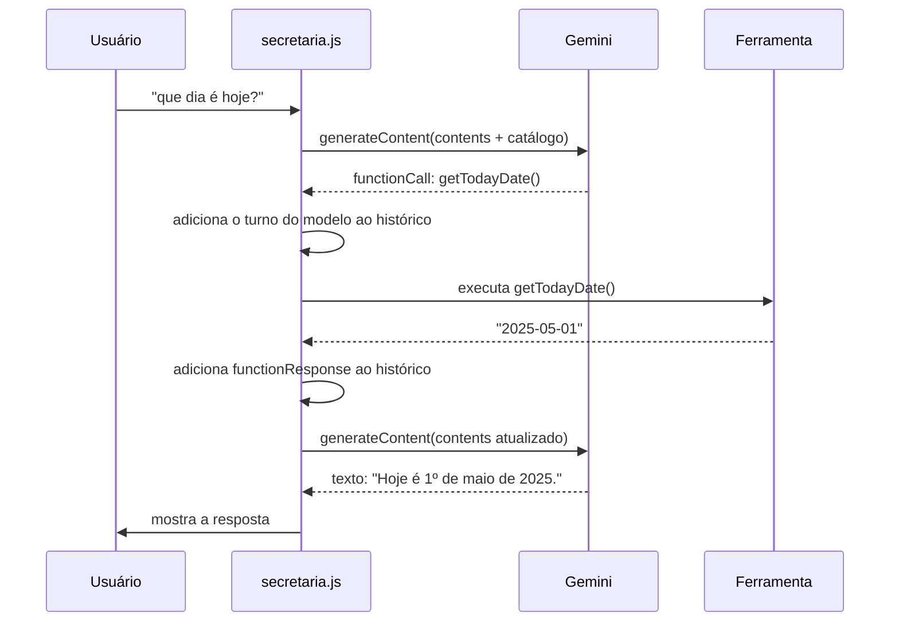
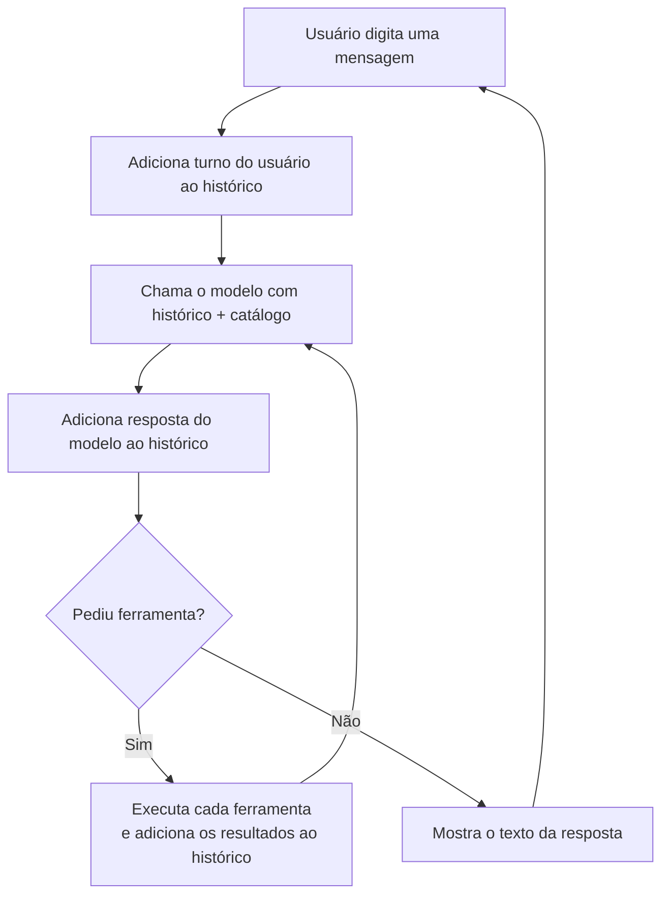

# Hands-on: Agente "SecretarIA"

## O objetivo

As notas anteriores desta seção montaram o quebra-cabeça por partes: [O que são agentes de IA](/labs/ai/agents/01-o-que-e/) apresentou o ciclo de percepção, raciocínio e ação; o [Paradigma ReAct](/labs/ai/agents/02-react/) mostrou como o modelo intercala pensamento e ação; [Uso de Ferramentas](/labs/ai/agents/03-ferramentas/) explicou como o modelo chama funções de verdade; e [Memória de Agentes](/labs/ai/agents/04-memoria/) tratou de como o agente guarda o que já aconteceu.

Agora vamos juntar tudo num projeto só: a **SecretarIA**, um agente de linha de comando que ajuda alguém a cuidar da agenda e dos e-mails conversando em português. Você digita "tenho algo marcado na sexta?" e ela consulta o calendário de verdade antes de responder; você pede "remarca a reunião de feedback para as 17h" e ela encontra o evento e muda o horário.

O código completo está na pasta `examples/secretaria` do repositório [ai-labs](https://github.com/caramelotech/ai-labs). Esta nota reconstrói o projeto do zero, explicando cada decisão. Ao final você vai ter um chat rodando no seu terminal parecido com este:

```text
SecretarIA pronta. Digite "sair" para encerrar.

Você: tenho algo marcado na sexta?
  ↳ chamando getTodayDate({})
  ↳ chamando getEvents({"date":"2025-05-02"})

SecretarIA: Na sexta, 02/05, você tem dois compromissos: "Almoço com equipe"
às 12:30 e "Reunião com cliente externo" às 17:00.

Você: sair
```

## O que a SecretarIA precisa fazer

Antes de programar, vale listar o que o agente precisa dar conta. Cada item vira uma **ferramenta** (uma função que o modelo pode chamar):

- Consultar a data de hoje
- Consultar os eventos de um dia da agenda
- Verificar se um horário específico está livre
- Marcar um novo compromisso
- Remarcar um compromisso existente
- Consultar a caixa de e-mails
- Enviar um e-mail
- Responder em linguagem natural, confirmando o que foi feito

As sete primeiras são ações concretas. A última não é uma ferramenta: é o comportamento padrão do modelo depois de agir, e a gente vai reforçar isso com uma instrução de sistema.

Repare que "verificar se um horário está livre" poderia ser resolvido só com "consultar os eventos do dia" mais um pouco de raciocínio do modelo. Ter uma ferramenta dedicada deixa a intenção explícita e a resposta mais confiável, que é justamente a recomendação da nota [Uso de Ferramentas](/labs/ai/agents/03-ferramentas/): ferramenta com nome direto erra menos.

## Preparando o ambiente

### Por que o Gemini do Google

Para um projeto de estudo, o [Google AI Studio](https://aistudio.google.com/) tem duas vantagens: a chave de API sai em um clique e existe um nível gratuito com limite diário suficiente para brincar sem cadastrar cartão. O modelo que vamos usar é o `gemini-flash-latest`, um apelido que sempre aponta para a versão Flash mais recente (a linha rápida e barata da família, que já chama funções muito bem). Em produção você fixaria uma versão exata, tipo `gemini-3.6-flash`, para o comportamento não mudar sem aviso.

Para gerar sua chave, acesse <https://aistudio.google.com/api-keys>, clique em "Create API key" e copie o valor. Guarde num lugar seguro, ele dá acesso à sua conta.

### O projeto Node

O exemplo usa **Node.js 18 ou mais novo** e módulos ES (o `import`/`export` moderno). Um `package.json` mínimo:

```json
{
  "name": "secretaria",
  "type": "module",
  "main": "src/secretaria.js",
  "engines": { "node": ">=18" },
  "scripts": { "start": "node src/secretaria.js" },
  "dependencies": {
    "@google/genai": "^1.52.0",
    "dotenv": "^16.6.1"
  }
}
```

Duas dependências só:

- **`@google/genai`** é o SDK oficial do Gemini para JavaScript. É ele que fala com a API.
- **`dotenv`** carrega variáveis de um arquivo `.env` para dentro do `process.env`, para a chave não ficar escrita no código.

Instale com:

```bash
npm install @google/genai dotenv
```

### Protegendo a chave de API

A chave nunca pode ir para o Git. O padrão é:

1. Criar um `.env` (que fica no `.gitignore`) com a chave de verdade:

   ```bash
   GEMINI_API_KEY=sua-chave-aqui
   ```

2. Versionar um `.env.example` sem valor, só para documentar o que o projeto espera:

   ```bash
   GEMINI_API_KEY=
   ```

3. Garantir a linha `.env` no `.gitignore`.

Quem clonar o repositório copia o `.env.example` para `.env` e preenche com a própria chave.

### A estrutura de pastas

```text
examples/secretaria/
├── .env.example
├── package.json
└── src/
    ├── secretaria.js      # o loop do agente
    └── tools/
        ├── calendar.js    # ferramentas de agenda
        └── email.js       # ferramentas de e-mail
```

Separar as ferramentas em arquivos por assunto não é obrigatório num projeto desse tamanho, mas ajuda a enxergar que "ferramenta" é uma peça independente do loop.

## A primeira chamada ao modelo

Antes de qualquer ferramenta, vale ver o modelo "puro" falhando. O código mais simples possível:

```javascript
import { GoogleGenAI } from "@google/genai";
import dotenv from "dotenv";

dotenv.config();

const ai = new GoogleGenAI({ apiKey: process.env.GEMINI_API_KEY });

const response = await ai.models.generateContent({
  model: "gemini-flash-latest",
  contents: [{ role: "user", parts: [{ text: "que dia é hoje?" }] }],
});

console.log(response.text);
```

O parâmetro `contents` é o histórico da conversa. Cada item é um **turno**, com:

- `role`: quem falou. `user` é a pessoa (ou o resultado de uma ferramenta), `model` é o Gemini.
- `parts`: o conteúdo do turno. Aqui é só um texto, mas mais para frente vai carregar chamadas de função e respostas de função.

Rodando isso, a resposta é algo como _"Não tenho acesso à data atual em tempo real..."_ ou, pior, uma data inventada. O motivo está na nota [Uso de Ferramentas](/labs/ai/agents/03-ferramentas/): o modelo é uma caixa preta treinada com dados do passado. Ele não tem relógio, não acessa a internet por conta própria e não sabe nada sobre a sua agenda. Para isso funcionar, a gente precisa **dar as ferramentas a ele**.

## Declarando ferramentas para o modelo

O modelo não enxerga o código das funções. Ele recebe um **catálogo**: a lista de ferramentas disponíveis, cada uma com nome, descrição e o formato dos parâmetros. Esse catálogo vai no campo `config.tools`, dentro de `functionDeclarations`:

```javascript
const declarations = [
  {
    name: "getTodayDate",
    description: "Retorna a data de hoje no formato yyyy-mm-dd",
  },
  {
    name: "getEvents",
    description: "Retorna os eventos do calendário para um determinado dia",
    parametersJsonSchema: {
      type: "object",
      properties: {
        date: {
          type: "string",
          description: "A data desejada, no formato yyyy-mm-dd",
        },
      },
      required: ["date"],
    },
  },
];

const response = await ai.models.generateContent({
  model: "gemini-flash-latest",
  contents: [{ role: "user", parts: [{ text: "que dia é hoje?" }] }],
  config: {
    tools: [{ functionDeclarations: declarations }],
  },
});

console.log(response.functionCalls);
```

Cada declaração tem:

- **`name`**: o identificador da função. É por ele que o nosso código vai achar a implementação.
- **`description`**: o que a ferramenta faz. É o texto que o modelo lê para decidir se aquela ferramenta serve para o pedido. Descrição vaga leva a escolha errada, principalmente quando há ferramentas parecidas.
- **`parametersJsonSchema`**: o formato dos argumentos, no padrão [JSON Schema](/labs/ai/agents/03-ferramentas/). `getTodayDate` não recebe nada, então nem aparece. `getEvents` recebe um `date` do tipo `string`, e a lista `required` diz que ele é obrigatório.

Agora, em vez de `response.text`, a gente lê `response.functionCalls`. Quando o modelo decide usar uma ferramenta, esse campo vem preenchido:

```javascript
[
  {
    name: "getTodayDate",
    args: {},
  },
];
```

O modelo não executou nada. Ele só devolveu um texto estruturado dizendo _"eu quero chamar `getTodayDate`, sem argumentos"_. Executar é problema nosso.

## Recebendo e respondendo uma function call

O ciclo completo de uma chamada de função tem quatro passos:



Traduzindo para código, depois da primeira resposta:

```javascript
// 1. o modelo pediu uma ferramenta
const call = response.functionCalls[0];

// 2. o turno do modelo (a chamada) precisa entrar no histórico
contents.push(response.candidates[0].content);

// 3. executamos a função de verdade
const result = "2025-05-01"; // o que getTodayDate() retornaria

// 4. devolvemos o resultado como um turno de "function response"
contents.push({
  role: "user",
  parts: [{ functionResponse: { name: call.name, response: { result } } }],
});

// 5. pedimos a resposta final, agora com o histórico completo
response = await ai.models.generateContent({
  model: "gemini-flash-latest",
  contents,
  config: { tools: [{ functionDeclarations: declarations }] },
});

console.log(response.text); // "Hoje é 1º de maio de 2025."
```

O passo 2 é fácil de esquecer e causa erro. A API do Gemini exige que **o turno com a `functionResponse` venha logo depois do turno com a `functionCall`**. Se você pular a linha `contents.push(response.candidates[0].content)`, o histórico fica com uma resposta de ferramenta que não corresponde a chamada nenhuma, e a API reclama. A regra prática: depois de toda chamada ao modelo, empurre `response.candidates[0].content` para o `contents`.

## Implementando as ferramentas da secretária

### O padrão `{ function, declaration }`

Cada ferramenta é um objeto com duas metades:

```javascript
const getTodayDate = {
  // a metade que roda de verdade
  function: () => {
    return "2025-05-01";
  },
  // a metade que o modelo enxerga
  declaration: {
    name: "getTodayDate",
    description: "Retorna a data de hoje no formato yyyy-mm-dd",
  },
};
```

Deixar as duas juntas no mesmo objeto evita o problema clássico de o schema dizer uma coisa e a função esperar outra. (No código original deste exemplo, a declaração de `getEvents` pedia um parâmetro `data` mas a função lia `date`, então a consulta nunca funcionava. Manter os dois lado a lado torna esse tipo de deslize mais visível.)

A data fixa em `getTodayDate` é de propósito: assim o exemplo é determinístico e sempre cai dentro do calendário fake. Num sistema real seria `new Date().toISOString().slice(0, 10)`.

### As ferramentas de agenda: `calendar.js`

Os dados ficam num objeto em memória, indexado por data:

```javascript
const calendar = {
  "2025-05-01": [
    { title: "Feriado do Dia do Trabalhador", time: "00:00" },
    {
      title: "Churrasco em família",
      time: "13:00",
      attendees: ["Rafael Oliveira", "Carla Souza", "Beatriz Rocha"],
    },
  ],
  // ... outros dias
};
```

Cinco ferramentas mexem nesse objeto:

```javascript
const getEvents = {
  function: ({ date }) => {
    return calendar[date] ?? [];
  },
  declaration: {
    name: "getEvents",
    description: "Retorna os eventos do calendário para um determinado dia",
    parametersJsonSchema: {
      type: "object",
      properties: {
        date: { type: "string", description: "A data, no formato yyyy-mm-dd" },
      },
      required: ["date"],
    },
  },
};

const checkAvailability = {
  function: ({ date, time }) => {
    const eventList = calendar[date] ?? [];
    const conflict = eventList.find((event) => event.time === time);

    if (conflict) {
      return `Ocupado: já existe "${conflict.title}" às ${time} em ${date}.`;
    }
    return `Livre: nenhum compromisso às ${time} em ${date}.`;
  },
  declaration: {
    name: "checkAvailability",
    description:
      "Verifica se um horário específico está livre na agenda de um dia",
    parametersJsonSchema: {
      type: "object",
      properties: {
        date: { type: "string", description: "A data, no formato yyyy-mm-dd" },
        time: { type: "string", description: "A hora, no formato HH:MM" },
      },
      required: ["date", "time"],
    },
  },
};
```

`scheduleEvent` e `rescheduleEvent` seguem a mesma forma: recebem `title`, `date` e horário, e retornam uma frase curta de confirmação (`"Evento adicionado com sucesso!"`). O retorno de uma ferramenta é sempre um texto que vai virar observação para o modelo, então uma frase clara ajuda ele a montar a resposta final.

### As ferramentas de e-mail: `email.js`

Mesma ideia, com uma inbox fake:

```javascript
const getEmails = {
  function: () => inbox,
  declaration: {
    name: "getEmails",
    description: "Retorna todos os e-mails na caixa de entrada",
  },
};

const sendEmail = {
  function: ({ to, subject, message }) => {
    console.log(`**E-mail enviado para ${to} - "${subject}": ${message}`);
    return "E-mail enviado!";
  },
  declaration: {
    name: "sendEmail",
    description: "Envia um e-mail para um endereço",
    parametersJsonSchema: {
      type: "object",
      properties: {
        to: { type: "string", description: "O endereço do destinatário" },
        subject: { type: "string", description: "O assunto do e-mail" },
        message: { type: "string", description: "O corpo da mensagem" },
      },
      required: ["to", "subject", "message"],
    },
  },
};
```

`sendEmail` só imprime no terminal, sem mandar nada de verdade. Num projeto real, aqui entraria a API do Gmail ou um serviço de envio.

### Juntando as ferramentas num mapa

O loop precisa, a partir do nome que o modelo pediu (`"getEvents"`), achar a função correspondente. A montagem:

```javascript
import { allDefinitions as calendarDefinitions } from "./tools/calendar.js";
import { allDefinitions as emailDefinitions } from "./tools/email.js";

const allDefinitions = [...calendarDefinitions, ...emailDefinitions];

// o catálogo que vai para o modelo
const declarations = allDefinitions.map((def) => def.declaration);

// o mapa nome -> função que o nosso código usa
const functionsByName = Object.fromEntries(
  allDefinitions.map((def) => [def.declaration.name, def.function]),
);
```

`Object.fromEntries` transforma uma lista de pares `[chave, valor]` num objeto. O resultado é `{ getTodayDate: fn, getEvents: fn, ... }`, pronto para `functionsByName[call.name]`.

## O loop de agente

Uma pergunta simples ("que dia é hoje?") resolve com uma chamada de função. Mas "tenho algo na sexta?" precisa de duas em sequência: primeiro descobrir qual é a data da sexta (`getTodayDate` e um pouco de contexto), depois consultar os eventos (`getEvents`). O modelo não sabe de antemão quantas vai precisar, então a gente roda um **loop**: enquanto ele pedir ferramenta, a gente executa e devolve; quando ele devolver texto, acabou.



O código, já com as boas práticas da próxima seção:

```javascript
import { GoogleGenAI } from "@google/genai";
import readline from "node:readline/promises";
import dotenv from "dotenv";
import { allDefinitions as calendarDefinitions } from "./tools/calendar.js";
import { allDefinitions as emailDefinitions } from "./tools/email.js";

dotenv.config();

if (!process.env.GEMINI_API_KEY) {
  console.error("Faltou a GEMINI_API_KEY. Copie o .env.example para .env.");
  process.exit(1);
}

const MODEL = "gemini-flash-latest";

const SYSTEM_INSTRUCTION = `Você é a SecretarIA, uma assistente que organiza a agenda e os e-mails de uma pessoa.
Use sempre as ferramentas disponíveis para consultar ou alterar dados reais, em vez de adivinhar.
Depois de agir, confirme em linguagem natural e de forma breve o que foi feito.
Se não existir ferramenta para o pedido, diga isso com honestidade em vez de inventar.`;

const allDefinitions = [...calendarDefinitions, ...emailDefinitions];
const declarations = allDefinitions.map((def) => def.declaration);
const functionsByName = Object.fromEntries(
  allDefinitions.map((def) => [def.declaration.name, def.function]),
);

const ai = new GoogleGenAI({ apiKey: process.env.GEMINI_API_KEY });

function askModel(contents) {
  return ai.models.generateContent({
    model: MODEL,
    contents,
    config: {
      systemInstruction: SYSTEM_INSTRUCTION,
      tools: [{ functionDeclarations: declarations }],
    },
  });
}

function runTool(call) {
  const fn = functionsByName[call.name];
  if (!fn) {
    return `Erro: a ferramenta "${call.name}" não existe.`;
  }
  try {
    return fn(call.args ?? {});
  } catch (error) {
    return `Erro ao executar "${call.name}": ${error.message}`;
  }
}

const rl = readline.createInterface({
  input: process.stdin,
  output: process.stdout,
});
const contents = [];

while (true) {
  let query;
  try {
    query = (await rl.question("Você: ")).trim();
  } catch {
    break; // stdin fechou (Ctrl+D ou fim de um pipe)
  }
  if (query === "" || query.toLowerCase() === "sair") break;

  const turnStart = contents.length;
  contents.push({ role: "user", parts: [{ text: query }] });

  try {
    let response = await askModel(contents);
    contents.push(response.candidates[0].content);

    while (response.functionCalls?.length) {
      for (const call of response.functionCalls) {
        console.log(`  ↳ chamando ${call.name}(${JSON.stringify(call.args ?? {})})`);

        const result = runTool(call);
        contents.push({
          role: "user",
          parts: [
            { functionResponse: { name: call.name, response: { result } } },
          ],
        });
      }
      response = await askModel(contents);
      contents.push(response.candidates[0].content);
    }

    console.log(`\nSecretarIA: ${response.text}\n`);
  } catch (error) {
    // Erro de rede ou da API (limite de uso, instabilidade) não derruba o chat.
    console.error(`\n[não consegui falar com o modelo: ${error.message}]\n`);
    contents.length = turnStart;
  }
}

rl.close();
```

O `contents` cresce a cada troca: mensagens do usuário, turnos do modelo, respostas de ferramenta. Ele é a **memória de curto prazo** do agente, a mesma ideia da nota [Memória de Agentes](/labs/ai/agents/04-memoria/): tudo que o modelo "lembra" está ali, e some quando o processo fecha.

### Testando

Alguns pedidos para experimentar depois de `npm start`:

```text
Você: o dia 2 de maio de 2025 está livre às 15h?
  ↳ chamando checkAvailability({"date":"2025-05-02","time":"15:00"})
SecretarIA: Sim, o dia 02/05 está livre às 15:00.

Você: então marca um dentista nesse horário
  ↳ chamando scheduleEvent({"title":"Dentista","date":"2025-05-02","time":"15:00"})
SecretarIA: Pronto, agendei "Dentista" para 02/05 às 15:00.

Você: remarca a reunião de feedback individual do dia 4 para as 17h
  ↳ chamando getEvents({"date":"2025-05-04"})
  ↳ chamando rescheduleEvent({"title":"Reunião de feedback individual","date":"2025-05-04","newTime":"17:00"})
SecretarIA: Remarquei a "Reunião de feedback individual" do dia 04/05 para as 17:00.
```

Na remarcação, o modelo encadeou duas ferramentas sozinho: primeiro `getEvents` para confirmar o título exato do compromisso, depois `rescheduleEvent`. Esse é o ciclo [ReAct](/labs/ai/agents/02-react/) acontecendo: cada resultado alimenta a próxima decisão.

## Boas práticas aplicadas no exemplo

O esqueleto acima já embute várias decisões que separam um exemplo que trava de um que se comporta bem:

- **Instrução de sistema com papel e limites.** O `systemInstruction` diz quem a SecretarIA é, manda ela usar ferramentas em vez de adivinhar e pede para admitir quando não há ferramenta para o pedido. Sem isso, o modelo às vezes "responde de memória" em vez de consultar os dados.
- **Validar antes de executar.** `runTool` checa se `functionsByName[call.name]` existe. Se o modelo alucinar um nome de função, a gente devolve um erro em texto em vez de deixar o código quebrar com `fn is not a function`.
- **Erro de ferramenta vira observação.** O `try/catch` em volta da execução transforma qualquer exceção numa string que volta para o modelo. Ele então decide se tenta de novo, tenta outra ferramenta ou avisa o usuário, exatamente o que a nota [Uso de Ferramentas](/labs/ai/agents/03-ferramentas/) recomenda.
- **Erro de API não derruba o chat.** A chamada ao modelo também pode falhar (limite de uso atingido, instabilidade momentânea, rede caindo). Um `try/catch` em volta do turno inteiro imprime uma mensagem curta, desfaz o turno incompleto (`contents.length = turnStart`) e devolve o controle para o usuário, em vez de estourar um stack trace e encerrar o processo.
- **Schema e descrição claros.** Nomes diretos (`checkAvailability`, `rescheduleEvent`) e descrições que dizem o efeito exato da função ajudam o modelo a escolher certo quando há ferramentas parecidas.
- **Chave de API fora do código.** `.env` no `.gitignore`, `.env.example` versionado, e uma checagem logo no início que dá uma mensagem clara se a variável estiver faltando.
- **Histórico consistente.** Todo turno do modelo e toda resposta de ferramenta entram no `contents` na ordem certa, senão a API do Gemini rejeita a próxima chamada.
- **Um jeito de sair.** O `while` verdadeiro tem uma condição de parada (`"sair"`, linha vazia ou `Ctrl+D`, que fecha o stdin e faz o `rl.question` lançar erro) e fecha o `readline` no final, em vez de depender de `Ctrl+C`.

### O que este exemplo não faz

Os dados de agenda e inbox são fixos e vivem só em memória: fechou o processo, tudo volta ao estado inicial. Não há persistência nem memória de longo prazo, então a SecretarIA não lembra de nada entre uma execução e outra. A data de hoje é fixa. E não há autenticação, tratamento de fuso horário nem validação de formato de data. Tudo isso é intencional, para o foco ficar no loop do agente.

## Indo além

Pontos naturais para evoluir o projeto:

- **Dados reais.** Trocar os objetos fake pelas APIs do Google Calendar e do Gmail. As assinaturas das ferramentas quase não mudam, o que muda é o corpo das funções.
- **Memória de longo prazo.** Guardar preferências do usuário ("sempre me deixe 30 min de intervalo entre reuniões") num banco e injetar no `systemInstruction` a cada sessão. Ver [Memória de Agentes](/labs/ai/agents/04-memoria/).
- **Expor as ferramentas via MCP.** Empacotar `calendar.js` e `email.js` como um servidor [MCP](/labs/ai/agents/06-mcp/) para que outros agentes (Claude Desktop, Claude Code, um agente próprio) usem as mesmas ferramentas sem reimplementar.
- **Usar um framework.** O loop `while` escrito na mão é ótimo para entender o mecanismo, mas frameworks de agentes cuidam de repetição, limite de iterações e streaming para você. Ver [Frameworks](/labs/ai/agents/09-frameworks/).

## Referências

- [Chamada de função com a API Gemini](https://ai.google.dev/gemini-api/docs/function-calling) - Google AI for Developers, pt-BR
- [Guia de início rápido da API Gemini](https://ai.google.dev/gemini-api/docs/quickstart) - Google AI for Developers, pt-BR
- [google-gemini/genai (SDK JavaScript) - documentação de Function Calling](https://github.com/googleapis/js-genai#function-calling) - Google, en
- [ReAct: Synergizing Reasoning and Acting in Language Models](https://arxiv.org/abs/2210.03629) - Yao et al., 2022, en
