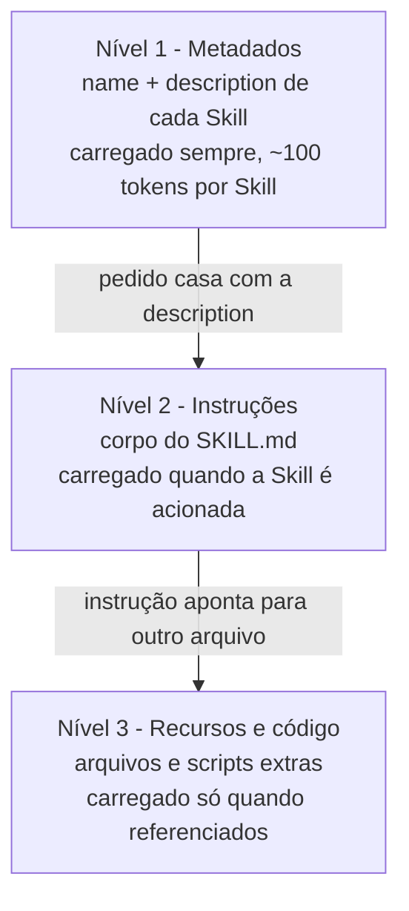

# Agent Skills

## O que são Agent Skills

Ferramentas e MCP ampliam o que um agente **consegue fazer**. As **Agent Skills** cuidam de outra dimensão: o que o agente **sabe fazer bem**. São lacunas diferentes. Um modelo de fronteira já vem com um repertório enorme de conhecimento geral, mas não conhece as convenções da sua empresa, o formato que o seu time espera num relatório nem a ordem exata dos passos de um processo interno. Esse é conhecimento de **procedimento**, e normalmente não está em lugar nenhum que o modelo alcance.

As saídas tradicionais para isso têm custo. Reexplicar o processo a cada conversa é trabalhoso e inconsistente. Colocar tudo no prompt de sistema incha o contexto e atrapalha as outras tarefas. Treinar um modelo sob medida é caro e congela o conhecimento numa versão. Uma **Skill** é um meio-termo: o procedimento fica escrito num arquivo, versionado como código, e o agente carrega esse arquivo **só quando a tarefa correspondente aparece**.

Esse "só quando precisa" é o princípio central. O agente mantém em contexto apenas um resumo curto de cada Skill disponível e busca o conteúdo completo sob demanda - a mesma ideia de _context engineering_ que faz o modelo trabalhar leve. Como cada Skill é uma pasta independente, várias podem coexistir e até se combinar numa mesma tarefa, sem que o agente pague o preço de carregar todas o tempo todo.

O nome oficial é **Agent Skills** (também aparece como Claude Skills), lançado pela Anthropic em outubro de 2025.

## O problema que as Skills resolvem

[Ferramentas](/labs/ai/agents/03-ferramentas/) e o [MCP](/labs/ai/agents/06-mcp/) dão ao agente acesso a sistemas: ele passa a conseguir consultar um banco, chamar uma API, mexer em arquivos. O que eles não fazem é ensinar o **jeito** de executar uma tarefa.

Um exemplo: você quer que o agente gere o changelog do projeto sempre no mesmo formato, lendo os commits de um jeito específico, ignorando certos tipos de mudança e agrupando o resto por área. Sem um lugar para guardar esse procedimento, você reexplica tudo a cada nova conversa. E quando outra pessoa do time vai usar o agente, ela não tem esse contexto.

Uma **Skill** empacota esse conhecimento de processo num formato que o agente carrega sozinho quando a tarefa aparece.

## O que é uma Skill

Uma Skill é uma pasta com instruções, e opcionalmente scripts e outros arquivos de apoio, que o agente lê quando precisa. A comparação que a Anthropic usa é a de um **guia de integração** que você escreveria para alguém novo no time: o passo a passo, as convenções, os exemplos e o que evitar.

Três características ajudam a entender o encaixe:

- Roda dentro do ambiente que o agente já tem (sistema de arquivos e execução de código), sem subir um serviço separado
- É só uma pasta, então compartilhar é colocar num repositório Git e mandar o link
- Pode trazer código pronto para o agente executar, não só texto

## Anatomia de uma Skill

Toda Skill tem, no mínimo, um arquivo `SKILL.md` na raiz da pasta. Ele começa com um bloco de **frontmatter YAML** com dois campos obrigatórios:

```markdown
---
name: gerar-changelog
description: Gera o changelog do projeto a partir dos commits, agrupado por área. Use quando o usuário pedir changelog, notas de versão ou release notes.
---

# Gerar changelog

## Instruções

1. Rode `git log` desde a última tag...
2. Ignore commits de tipo `chore` e `test`...

## Exemplos

...
```

Regras dos campos:

- `name`: até 64 caracteres, só letras minúsculas, números e hífens
- `description`: até 1024 caracteres, não pode ser vazio, e precisa dizer **o que a Skill faz e quando usá-la** (é esse texto que o modelo usa para decidir se aciona a Skill)

Abaixo do frontmatter vem o corpo em Markdown normal: o fluxo de trabalho, as regras, o formato de saída, exemplos e restrições. Se a Skill precisa de mais material (um guia detalhado, um schema de banco, um script), esses arquivos ficam na mesma pasta e são citados pelo nome dentro do `SKILL.md`.

```
gerar-changelog/
  SKILL.md          instruções principais
  FORMATO.md        o template detalhado do changelog
  scripts/
    agrupar.py      script utilitário
```

## Progressive disclosure: carregar só o necessário

Uma Skill poderia ser grande, com dezenas de arquivos de referência. Se tudo isso entrasse no contexto de uma vez, sobraria pouco espaço para o resto. O mecanismo que evita esse problema é a **divulgação progressiva** (progressive disclosure): o agente carrega a informação em camadas, só quando precisa.



Na prática:

- No começo da conversa, só o `name` e a `description` de cada Skill instalada ocupam contexto. Dá para ter muitas Skills sem pesar
- Quando o pedido casa com a descrição, o agente lê o `SKILL.md` inteiro (normalmente abaixo de 5 mil tokens)
- Arquivos extras só são abertos se a tarefa pedir. Um arquivo de referência que ninguém consultou custa zero
- Scripts são um caso à parte: o agente **executa** o script e recebe só a saída. O código em si nunca entra no contexto, o que é bem mais econômico do que pedir para o modelo gerar o mesmo código na hora

## Como o agente escolhe uma Skill

Não é o usuário que aponta qual Skill usar. O modelo compara o pedido com a `description` de cada Skill disponível e, se bater, aciona sozinho. Por isso a `description` é a parte mais importante de escrever bem: uma descrição vaga faz a Skill nunca ser acionada, ou ser acionada na hora errada.

Depois de carregada, a resposta do agente segue o que a Skill define: o formato de saída, o tom, a sequência de passos. É esse "seguir o playbook" que dá a repetibilidade.

Vale notar que as Skills não substituem as ferramentas nem o MCP. Uma Skill pode, no meio das instruções, mandar o agente chamar uma ferramenta ou rodar um dos seus próprios scripts.

## MCP e Skills: alcance vs know-how

MCP e Skills resolvem problemas diferentes e funcionam juntos.

| Aspecto        | MCP                                                                 | Skills                                                  |
| -------------- | ------------------------------------------------------------------- | ------------------------------------------------------- |
| O que entrega  | alcance: conexão com sistemas externos (banco, API, outro software) | know-how: o procedimento e o formato de uma tarefa      |
| Como roda      | um servidor separado, falando um protocolo                          | uma pasta lida dentro do ambiente do agente             |
| Escolha quando | o agente precisa alcançar algo que não acessa nativamente           | você quer padronizar como uma tarefa recorrente é feita |
| Público típico | quem monta a infraestrutura                                         | quem define o processo                                  |

A frase que resume: **o MCP dá alcance ao agente, as Skills dão know-how.** Uma Skill de "fechar o mês financeiro" pode descrever o passo a passo (know-how) e, nos pontos certos, usar as ferramentas de um MCP server de contabilidade (alcance).

## Onde as Skills funcionam

O formato da pasta é o mesmo em todo lugar, mas a instalação e o ambiente mudam conforme o produto:

- **Claude Code:** a Skill é um diretório em `~/.claude/skills/` (pessoal) ou `.claude/skills/` (do projeto). O agente descobre sozinho. Aqui a Skill tem acesso total à rede, como qualquer programa na sua máquina
- **API do Claude:** as Skills rodam junto com a ferramenta de execução de código, num contêiner isolado sem acesso à rede. Você sobe suas Skills pela API de Skills
- **claude.ai:** upload de um `.zip` nas configurações, disponível nos planos pagos com execução de código ligada. A Skill é individual de cada usuário

Um detalhe que pega: Skills **não sincronizam entre esses ambientes**. Uma Skill enviada para o claude.ai não aparece na API nem no Claude Code; cada superfície é gerenciada à parte.

## Cuidado com a origem da Skill

Como uma Skill carrega instruções e código que o agente vai executar, ela tem o mesmo peso de instalar um programa. Uma Skill maliciosa pode mandar o agente vazar dados ou rodar comandos fora do propósito declarado.

A recomendação da Anthropic é direta: use só Skills que você mesmo escreveu ou que vieram de uma fonte confiável. Se precisar usar uma de origem desconhecida, leia todos os arquivos antes, incluindo os scripts, e desconfie de Skills que buscam conteúdo de URLs externas.

## Referências

- [Agent Skills - visão geral](https://platform.claude.com/docs/pt-BR/agents-and-tools/agent-skills/overview) - Anthropic (Claude Platform Docs), pt-BR
- [Estenda o Claude com skills](https://code.claude.com/docs/pt/skills) - Anthropic (Claude Code Docs), pt-BR
- [Melhores práticas de autoria de Skills](https://platform.claude.com/docs/pt-BR/agents-and-tools/agent-skills/best-practices) - Anthropic (Claude Platform Docs), pt-BR
- [Equipping agents for the real world with Agent Skills](https://www.anthropic.com/engineering/equipping-agents-for-the-real-world-with-agent-skills) - Anthropic Engineering, en
