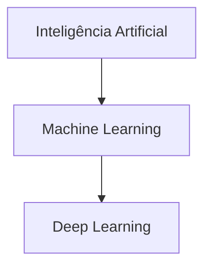

# Introdução à Inteligência Artificial

## O que é Inteligência Artificial?

Inteligência Artificial (IA) é um campo da ciência da computação dedicado a criar sistemas capazes de realizar tarefas que normalmente exigiriam inteligência humana. Pense nela como a capacidade de ensinar máquinas a "pensar" e tomar decisões de forma semelhante aos humanos, mas usando algoritmos e dados.

### Conceitos básicos

**Inteligência Artificial é** o **campo mais amplo**. Refere-se à capacidade de **máquinas simularem a inteligência humana**, ou seja, realizarem tarefas que normalmente exigiriam inteligência humana, como:

- Tomar decisões
- Reconhecer padrões
- Traduzir idiomas
- Jogar xadrez ou dirigir carros

> 💡 **Nota:** a IA **engloba todas as técnicas e métodos** para fazer máquinas "pensarem".

## Como a IA funciona

Para entender como a IA funciona, vou usar uma analogia: imagine que você está ensinando uma criança a identificar frutas.

### Analogia: aprendendo a reconhecer frutas

**Aprendizado humano:** você mostra várias maçãs para a criança, explicando "isso é uma maçã, é redonda, vermelha ou verde, tem cabinho". Depois de ver muitos exemplos, a criança aprende a reconhecer maçãs sozinha.

**Aprendizado de máquina (Machine Learning):** funciona de forma similar. Você alimenta o computador com milhares de imagens de maçãs rotuladas como "maçã". O algoritmo analisa padrões, cores, formas, texturas, e cria um modelo matemático. Quando recebe uma nova imagem, ele compara com esses padrões aprendidos e identifica se é uma maçã ou não.

## Inteligência Artificial, Machine Learning e Deep Learning

Entender a diferença entre esses três conceitos ajuda a situar onde cada técnica se aplica.

### Inteligência Artificial (IA)

**Inteligência Artificial é** o **campo mais amplo**. Refere-se à capacidade de **máquinas simularem a inteligência humana**.

### Machine Learning (Aprendizado de Máquina)

**Aprendizado de Máquina é** uma **subárea da IA**. Em vez de programar cada passo que a máquina deve seguir, no ML:

- A máquina **aprende com dados**.
- Ela **identifica padrões** e **melhora automaticamente** com a experiência, sem ser reprogramada.

> 💡 **Exemplo:** um algoritmo que aprende a reconhecer e-mails como spam com base em exemplos.

### Deep Learning (Aprendizado Profundo)

**Já o Deep Learning é** uma **subárea dentro do Machine Learning**, inspirada no funcionamento do cérebro humano, utilizando **redes neurais artificiais profundas**.

- Usa **grandes volumes de dados** e **muito poder computacional**.
- É o que permite, por exemplo:
  - Reconhecimento facial no celular
  - Traduções automáticas com alta precisão
  - Geração de texto (como o ChatGPT)

### Hierarquia dos conceitos

Cada nível é um refinamento do anterior. Ou seja:

- **Todo Deep Learning é Machine Learning.**
- **Todo Machine Learning é uma forma de Inteligência Artificial.**
- Mas nem toda IA usa Machine Learning, e nem todo ML usa Deep Learning.

## Por que aprender a utilizar IA?

A Inteligência Artificial (IA) se baseia na capacidade de os dispositivos pensarem como seres humanos, conseguindo aprender, perceber, raciocinar, decidir e deliberar de forma racional e inteligente. Essa tecnologia **permite uma maior automação em processos e redução de custos, além de maior comodidade**.

A IA tem o potencial de transformar a maneira como realizamos uma série de tarefas, economizando inúmeras horas de esforço humano.

Se você for capaz de detalhar uma tarefa em etapas claras e lógicas, a IA pode assumir essa tarefa por você, seja escrevendo textos, gerando código, criando imagens, analisando dados ou automatizando partes do seu trabalho.

Para executar modelos de IA localmente, uma opção prática é o `LM Studio` (`https://lmstudio.ai/`), que permite rodar modelos em seu próprio computador.

A IA está presente em diversos aspectos do nosso dia a dia:

- **Assistentes Virtuais:** Alexa, Siri, Google Assistant
- **Recomendações:** Netflix, Spotify, YouTube
- **Reconhecimento de Imagem:** Filtros do Instagram, desbloqueio facial
- **Tradução Automática:** Google Tradutor, DeepL
- **Carros Autônomos:** Tesla, Waymo
- **Saúde:** Diagnóstico de doenças, descoberta de medicamentos
- **Finanças:** Detecção de fraudes, análise de crédito

Em [Componentes e Tipos de IA](/labs/ai/fundamentos/02-componentes-e-tipos-de-ia/) você vai ver do que a IA moderna é feita na prática e as diferenças entre IA estreita e IA geral.
