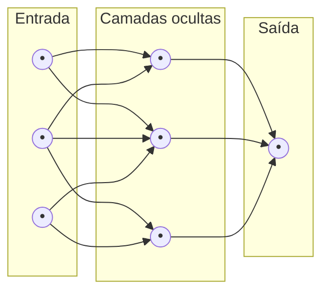

# Como as Redes Neurais Funcionam

As redes neurais são uma das técnicas mais populares de IA atualmente. Elas são compostas por "neurônios" artificiais organizados em camadas.

**Camada de entrada:** recebe os dados brutos (como pixels de uma imagem ou palavras convertidas em números).

**Camadas intermediárias (ocultas):** processam a informação, identificando padrões cada vez mais complexos. Nas primeiras camadas, podem ser detectadas bordas simples; nas seguintes, formas mais complexas; e assim por diante.

**Camada de saída:** produz o resultado final (por exemplo, "isso é um gato" ou "isso é um cachorro", ou ainda a próxima palavra de um texto).

Durante o treinamento, a rede faz previsões, compara com as respostas corretas, calcula o erro e ajusta seus parâmetros internos para melhorar. Esse processo se repete milhares ou milhões de vezes até que a rede fique precisa.
