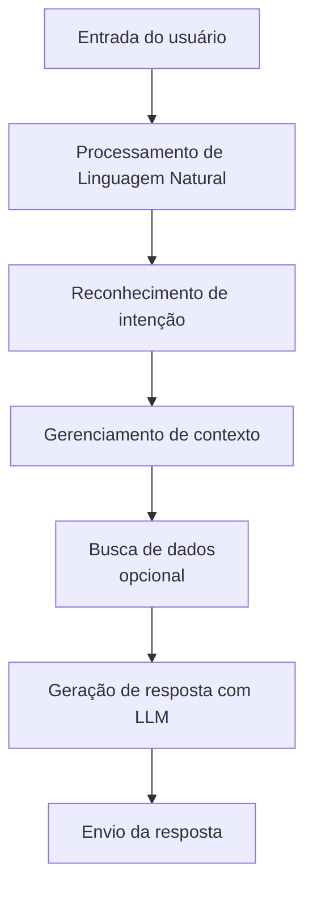

# O que são LLMs

**LLMs** (Large Language Models, ou Modelos de Linguagem em Larga Escala) são sistemas de inteligência artificial baseados em redes neurais de aprendizado profundo (deep learning), treinados com volumes massivos de dados textuais.

Eles compreendem, processam e geram linguagem natural, prevendo sequências de palavras. São aplicados em:

- Chatbots e assistentes virtuais
- Tradução automática
- Resumo de textos
- Geração de textos criativos
- Geração e explicação de código

## Exemplos de LLMs populares

- **GPT (OpenAI):** utilizado no ChatGPT
- **PaLM e BERT (Google):** modelos focados em raciocínio e compreensão de linguagem
- **Llama (Meta):** modelo de linguagem de código aberto
- **Claude (Anthropic):** modelo usado neste próprio material de estudo

## Como um chatbot usa um LLM

Um chatbot moderno baseado em LLM segue, em geral, o seguinte fluxo:

1. **Entrada do usuário:** a pessoa envia uma mensagem em linguagem natural.
2. **Processamento de Linguagem Natural (PLN):** o texto é analisado e transformado em uma representação que o modelo consegue entender.
3. **Reconhecimento de intenção:** o sistema identifica qual é o objetivo do usuário (perguntar algo, pedir uma ação, solicitar um resumo, etc.).
4. **Gerenciamento de contexto:** o histórico da conversa e outras informações relevantes são organizados para que o modelo responda de forma coerente.
5. **Busca de dados (opcional):** se necessário, o sistema consulta bases de dados, APIs ou documentos externos.
6. **Geração de resposta com LLM:** o modelo gera uma resposta em texto, prevendo token a token.
7. **Envio da resposta:** a resposta final é entregue ao usuário no chat.

Esse fluxo é a base sobre a qual conceitos mais avançados, como PLN, tokens e Context Engineering, se encaixam.
