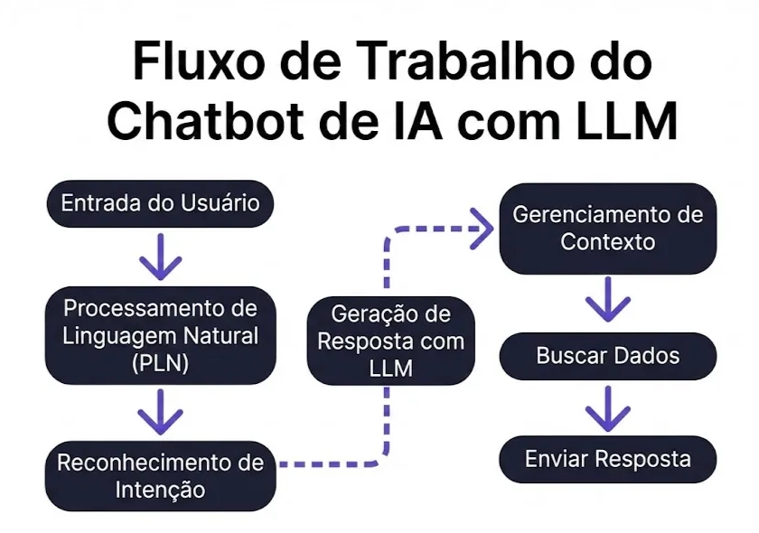

# PLN (Processamento de Linguagem Natural)

O **Processamento de Linguagem Natural (PLN)** é uma área da inteligência artificial dedicada à compreensão e ao processamento da linguagem humana por meio de sistemas computacionais.

O objetivo central do PLN é capacitar máquinas a **compreenderem, interpretarem e gerarem linguagem humana** de forma precisa e contextualmente relevante.

Por meio de técnicas de PLN, sistemas de IA podem executar tarefas como:

- Tradução automática
- Análise de sentimentos
- Geração de resumos
- Classificação de textos
- Extração de informações importantes em documentos longos

Assistentes virtuais como Siri e Alexa utilizam extensivamente o PLN para compreender e processar as solicitações dos usuários. É essa etapa que aparece logo no início do [fluxo de um chatbot com LLM](/labs/ai/llm/01-o-que-sao-llms/), transformando a mensagem crua do usuário em algo que o modelo consegue interpretar.

Para entender mais, uma boa referência é o artigo da Elastic sobre **[PLN vs LLMs](https://www.elastic.co/pt/blog/nlp-vs-llms)**.
